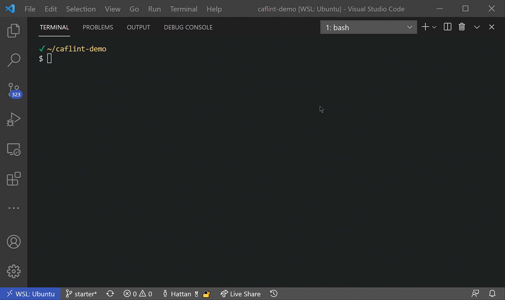

# caflint [](https://github.com/aztfmod/caflint/actions/workflows/ci.yml)

caflint is a linter that can validate configurations for the [Cloud Adoption Framework for Azure landing zones on Terraform (caf)](https://github.com/Azure/caf-terraform-landingzones)

CAF uses .tfvars configuration files to define resources to deploy on Azure. Caflint valies that the tfvars file is syntactically correct and also ensures that configurations in the file are valid inputs for the specified landing zone.

## Demo

* linting:
  
   <br/> <br/>


* Show all available configuration options:
  
  

## Prerequisites

Before using caflint please ensure you have a valid CAF landing zone and configurations folder.

For testing purposes you can clone the following repos :

* `git clone https://github.com/Azure/caf-terraform-landingzones.git .caf/landingzones`
* `git clone https://github.com/Azure/caf-terraform-landingzones-starter.git .caf/configs`

## Configuration

caflint accepts either command line configurations or a .caflint.hcl configuration file. A combination of both can also be used.

### .caflint.hcl

```terraform
config {
  landingZonePath = "<Path to landing zone folder>"
  configPath = "<Path to configurations folder>"
}
```

example (assuming the testing repos from above):

```terraform
config {
  landingZonePath = ".caf/landingzones/caf_solution"
  configPath = ".caf/configs/configuration/demo/level2/networking/hub"
}
```

### cli arguments

The following options can be passed into caflint. These can be used with the .caflint.hcl file or without.

* `-lz <path to landing zone>`
  
  Example: `caflint -lz .caf/landingzone/caf_solution`

* `-var-folder <path to configuration folder>`
  
  Example: `caflint -var-folder .caf/configs/networking`

If a a .caflint.hcl file exists, the configurations will be loaded from there first, but options passed in via the cli will always take precedence. 

It is also possible to pas sin both -lz and -var-folder without a .caflint.hcl file.

Example: `caflint -lz .caf/landingzone/caf_solution -var-folder .caf/configs/networking`
## Installation

* Prebuilt Releases and Docker images coming soon.
* Build from source (see next section).

## Building

```
make build
PATH=$PATH:$(pwd)/bin
```

This will build an `caflint` executable in the bin directory.

## Running Tests

From the root of the repo tests can be invoked via the make file and `make test`

or directly using `go test ./... -v`

## Return Codes

caflint uses specific return codes to indicate different fail conditions. Please see [lint/return_codes.go](return_codes.go)

| Code      | Constant | Description
| ---------------- | -------- |------------
| 0 | SUCCESS | Linting passed, all paths are valid
| 1 | LINT_ERROR | Paths are valid, but there are caf lint errors
| 2 | FILE_OR_FOLDER_NOT_FOUND | Invalid path, usually the landingzone or configuration path
| 3 | INVALID_FILE_FORMAT | A file it nor formatted correctly
| 4 | INVALID_TFVARS_SYNTAX | one of the .tvfars file is malformed
| 5 | INVALID_VARIABLE_FILE_SYNTAX | One of the variables.*.tf files in the landing zone is malformed
| 6 | NO_TFVARS_FOUND | No files with a .tfvars extension found in the config path
| 7 | NO_VARIABLE_FILES_FOUND | No files with the format variables.*.tf found in the landing zone path
